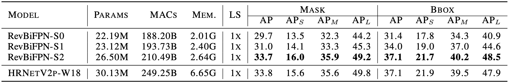

# RevBiFPN
RevBiFPN: The Fully Reversible Bidirectional Feature Pyramid Network

## Introduction
This is the official code of [RevBiFPN: The Fully Reversible Bidirectional Feature Pyramid Network](https://arxiv.org/abs/TODO) implemented in [PyTorch](https://papers.nips.cc/paper/2019/hash/bdbca288fee7f92f2bfa9f7012727740-Abstract.html).
We use RevSilo, a Bidirectional Reversible Multi-Scale Feature Fusion module implemented in `./RevSilo`, to create the RevBiFPN backbone.
We augment the RevBiFPN backbone with a classification head and pre-train RevBiFPN-S0 through RevBiFPN-S6 on [ImageNet](https://www-cs-faculty.stanford.edu/groups/vision/documents/ImageNet_CVPR2009.pdf).


### Network Motivation
A neural network uses hidden activations to compute the gradient of the weights with respect to the loss.
Generally, while training a neural network, the autograd framework will cache the hidden activations used in the forward pass, to be used during backpropagation.
The activation cache consumes the majority of the accelerator's memory, limiting the network size.
Networks using reversble recomputation, can recompute the network's hidden activations 
This work is the first to create a fully reversible network with Bidirectional Multi-Scale Feature Fusion and an FPN output making it a drop-in replacement for networks such as EfficientDet and HRNet.
The figure below shows how, for classification, RevBiFPNs significantly outperform EfficientNets at all scales.
In particular, RevBiFPN-S6 achieves comparable accuracy (84.2%) to EfficientNet-B7 on ImageNet while using comparable MACs (38.2B) and 19.8x lesser training memory per sample.


The table shows how, when used for instance segmentation and object detection, systems using the RevBiFPN backbone, consume considerably less memory.



## ImageNet pretrained models
| Model       | #Params | Res  | GMACs | top-1 acc | Link |                                                           SHA256 |
|        :--: |    :--: | :--: |  :--: |      :--: | :--: |                                                             :--: |
| RevBiFPN-S0 |   3.42M | 224  |  0.31 |     72.8% | TODO | a9ee012a2670003ea18deca1afaed7c1323ffaafc83b0a30874d262bf2403cfa |
| RevBiFPN-S1 |   5.11M | 256  |  0.62 |     75.9% | TODO | 584b0c3ea677ac5eff6c0f54b4b683973e7533bfde334155cd770aef041673c4 |
| RevBiFPN-S2 |  10.6M  | 256  |  1.37 |     79.0% | TODO | 62ff9387b498550d31e248742a002be22cb29e800cd387ec9c93b6da7418dcc8 |
| RevBiFPN-S3 |  19.6M  | 288  |  3.33 |     81.1% | TODO | 1695576b09ee9fc584df616abaf0762188122468825cc92b5abfeec63b609d25 |
| RevBiFPN-S4 |  48.7M  | 320  | 10.6  |     83.0% | TODO | 61d7b65524000bb147aac26ad559906a2380e55a499d9d420063cc2b9e2ef42a |
| RevBiFPN-S5 |  82.0M  | 352  | 21.8  |     83.7% | TODO | d7713a25c7f62bf4b9ebaa2693a7b6896e7965c6647cbd1d98eddeae8b74cdc3 |
| RevBiFPN-S6 | 142.3M  | 352  | 38.1  |     84.2% | TODO | 31f355d5fb54610ad9051d08d0ec10bb0d33f40c0936352cb863b9f9a3d4fa09 |

Weights are trained on ImageNet. See [ImageNet license](https://image-net.org/download.php).

## Training

### Classification
For classification, we train RevBiFPN by importing it into [pytorch-image-models' trian.py](https://github.com/rwightman/pytorch-image-models/blob/master/train.py) and running their training script.
Hyperparameters can be found in the [paper](https://arxiv.org/abs/TODO).

Note: if `python revbifpn.py` is run standalone by the user, RevBiFPN-S0 through RevBiFPN-S6 are instantiated and the network MAC / parameter counts are produced (uses [thop](https://pypi.org/project/thop/))

### Detection and Segmentation
For Detection and Segmentation we use the [MMDetection](https://github.com/open-mmlab/mmdetection) and [MMSegmentation](https://github.com/open-mmlab/mmsegmentation) repositories, respectively.
Generally speaking, we use the HRNet training configurations but replace the HRNet backbone with RevBiFPN variants for fine-tuning.

## Citation
To cite this work use:
TODO
````
@article{chiley2020revbifpn,
  title={RevBiFPN: The Fully Reversible Bidirectional Feature Pyramid Network},
  author={Chiley, Vitaliy and Gupta, Abhay and Thangarasa, Vithursan and Samar, Anshul and Hestness, Joel and DeCoste, Dennis},
  year={2022}
}
````
