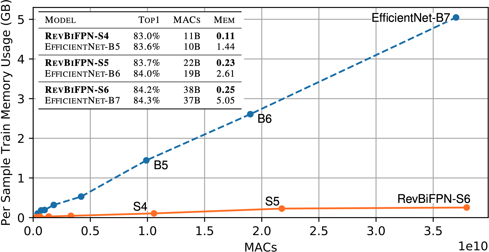

# RevBiFPN
RevBiFPN: The Fully Reversible Bidirectional Feature Pyramid Network

## Introduction
This is the official code of [RevBiFPN: The Fully Reversible Bidirectional Feature Pyramid Network](https://arxiv.org/abs/2206.14098) implemented in [PyTorch](https://papers.nips.cc/paper/2019/hash/bdbca288fee7f92f2bfa9f7012727740-Abstract.html).
RevSilo, the first reversible bidirectional multi-scale feature fusion module (implemented in `./rev_structs`), is used to create the RevBiFPN backbone.
We augment the RevBiFPN backbone with a classification head to pre-train RevBiFPN-S0 through RevBiFPN-S6 on [ImageNet](https://www-cs-faculty.stanford.edu/groups/vision/documents/ImageNet_CVPR2009.pdf).

<p align = "center"></p>
<p align = "center"><sub>RevBiFPN with classification head.</sub></p>

### Network Motivation
A neural network uses hidden activations to compute the gradient of the weights with respect to the loss.
When training a neural network, autograd frameworks will cache the hidden activations used in the forward pass to be used during backpropagation.
The activation cache consumes the majority of the accelerator's memory, limiting network scaling.

<p align = "center"></p>

Networks using reversble recomputation, can recompute the network's hidden activations instead of needing to store them.
This work is the first to create a fully reversible bidirectional multi-scale feature fusion pyramid network to serve as a drop-in replacement for FPN backbones such as EfficientDet and HRNet.
The figure below shows how, for classification, RevBiFPN uses significantly less memory than EfficientNet at all scales.
For example, RevBiFPN-S6 achieves comparable accuracy to EfficientNet-B7 on ImageNet (84.2% vs 84.3%) while using comparable MACs (38B vs 37B) and 19.8x lesser training memory per sample.

<p align = "center"></p>
<p align = "center"><sub>MACs vs measured memory usage for ImageNet training on 1 GPU.</sub></p>

Systems using the RevBiFPN backbone, consume considerably less memory for detection and segmentation with Faster R-CNN and Mask R-CNN, respectively.

<table>
<tr>
<td> 
<p align = "center"></p>
<p align = "center"><sub>Object detection in the Faster R-CNN framework.</sub></p>
</td>
<td>
<p align = "center"></p>
<p align = "center"><sub>Instance segmentation in the Mask R-CNN framework.</sub></p>
</td>
</tr>
</table>

### ImageNet models
| Model       | #Params | Res  | GMACs | top-1 acc |
|        :--: |    :--: | :--: |  :--: |      :--: |
| RevBiFPN-S0 |   3.42M | 224  |  0.31 |     72.8% |
| RevBiFPN-S1 |   5.11M | 256  |  0.62 |     75.9% |
| RevBiFPN-S2 |  10.6M  | 256  |  1.37 |     79.0% |
| RevBiFPN-S3 |  19.6M  | 288  |  3.33 |     81.1% |
| RevBiFPN-S4 |  48.7M  | 320  | 10.6  |     83.0% |
| RevBiFPN-S5 |  82.0M  | 352  | 21.8  |     83.7% |
| RevBiFPN-S6 | 142.3M  | 352  | 38.1  |     84.2% |

## Training

### Classification
For classification, we train RevBiFPN using [pytorch-image-models' trian.py](https://github.com/rwightman/pytorch-image-models/blob/master/train.py).
Hyperparameters can be found in the [RevBiFPN paper](https://arxiv.org/abs/2206.14098).

Note: running  `python revbifpn.py`, will instantiate and produce network MAC / parameter counts for RevBiFPN-S0 through RevBiFPN-S6 (uses [thop](https://pypi.org/project/thop/)).

### Detection and Segmentation
For detection and segmentation we use [MMDetection](https://github.com/open-mmlab/mmdetection).
HRNet configs are used to fine-tune networks with RevBiFPN backbones.

## Citation
To cite this work use:
````
@article{chiley2022revbifpn,
  title={RevBiFPN: The Fully Reversible Bidirectional Feature Pyramid Network},
  author={Chiley, Vitaliy and Thangarasa, Vithursan and Gupta, Abhay and Samar, Anshul and Hestness, Joel and DeCoste, Dennis},
  journal={arXiv preprint arXiv:2206.14098},
  year={2022}
}
````
