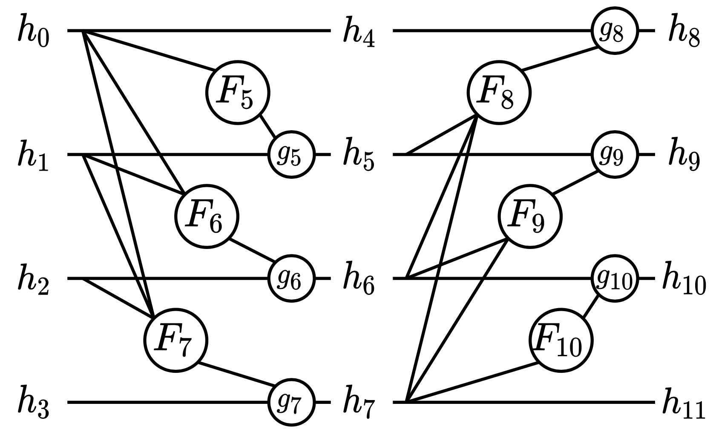

# RevStructs
Reversible Structures

The RevStructs library implements the RevSilo, as well as other reversible structures, in [PyTorch](https://papers.nips.cc/paper/2019/hash/bdbca288fee7f92f2bfa9f7012727740-Abstract.html).

RevSilo is the first bidirectional multi-scale feature fusion module that is invertible.

<p align = "center"></p>

## Installation
While not needed for running RevBiFPN, installing RevStructs as a library, enables the user to easily use RevSilo, as well as other reversible structures, in other projects.

```bash
python -m pip install -e .
```

(RevBiFPN just imports RevStructs since it is in its dir path).

## Usage

see examples in tests

## Testing installation

To test after installation:
```bash
python setup.py test
```
